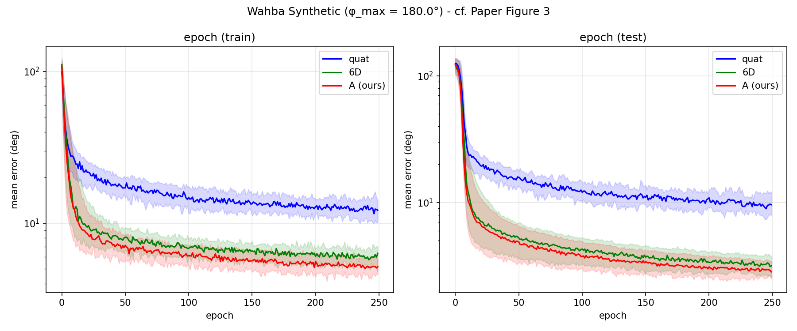
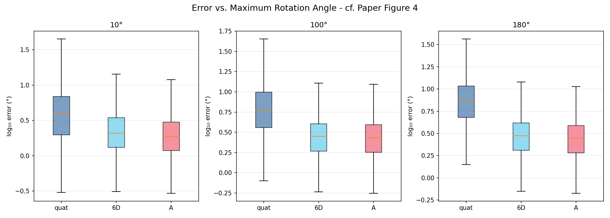
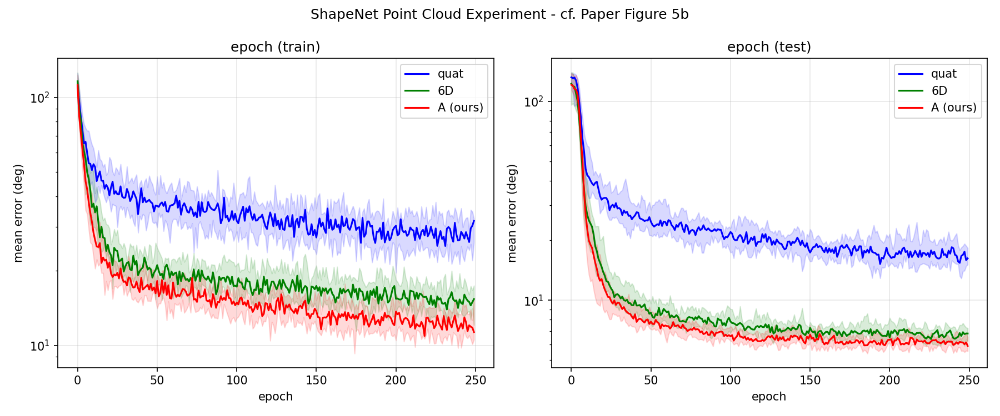
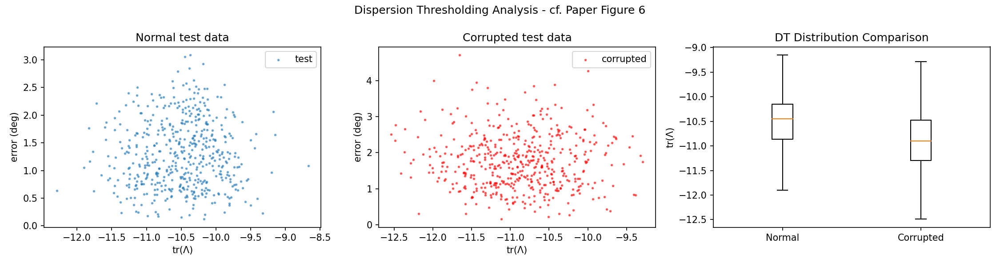

# Deep Rotation Learning Reproduction

Reproduction of **"A Smooth Representation of Belief over SO(3) for Deep Rotation Learning with Uncertainty"** (Peretroukhin et al., 2021)

## Paper Information

- **Paper**: [arXiv 2006.01031](https://arxiv.org/abs/2006.01031)
- **Official Code**: [utiasSTARS/bingham-rotation-learning](https://github.com/utiasSTARS/bingham-rotation-learning)
- **Reproduced by**: Jeffrey (Hohai University)

## Key Idea

The paper proposes a **symmetric matrix A** representation for rotation learning, addressing the discontinuity problem of quaternion representations:

```
Network output θ ∈ R¹⁰ → Symmetric matrix A(θ) → Eigendecomposition → Minimum eigenvector = quaternion q*
```

**Advantages**:
1. **Continuity**: Overcomes the 180° discontinuity caused by q/-q equivalence in quaternions
2. **Uncertainty**: Eigenvalue gaps naturally encode Bingham distribution, providing uncertainty estimation
3. **Generality**: Applicable to various inputs including point clouds and images

## Reproduction Results

### Experiment 1: Synthetic Wahba Problem (Figure 3)



- **Red (A/ours)**: Lowest error, fastest convergence
- **Green (6D)**: Second best
- **Blue (quat)**: Highest error with large variance

### Experiment 1b: Maximum Rotation Angle Comparison (Figure 4)



- At φ_max = 180°, quaternion representation error increases significantly (discontinuity issue)

### Experiment 2: ShapeNet Point Cloud (Figure 5)



### Experiment 3: KITTI Visual Odometry + OOD Detection (Figure 6, Table I)



| Model | Normal Error | Corrupted Error |
|-------|-------------|-----------------|
| quat | 1.23° | 1.49° |
| 6D | 1.37° | 1.58° |
| A | 1.30° | 1.75° |
| A + DT | 1.26° (74%) | 1.74° (88%) |

## Project Structure

```
.
├── rotations.py              # Core: rotation representations (quat/6D/A)
├── models.py                 # Networks: PointNet + CNN
├── losses.py                 # Loss functions: L_chord / L_quat / L_ang
├── run_wahba_synthetic.py    # Exp 1: Synthetic Wahba problem
├── run_phi_comparison.py     # Exp 1b: Angle comparison
├── run_shapenet.py           # Exp 2: ShapeNet point cloud
├── run_kitti.py              # Exp 3: KITTI + OOD detection
├── run_all.sh                # Run all experiments
├── setup_autodl.sh           # AutoDL environment setup
├── results/                  # Experiment results
└── README.md
```

## Quick Start

### Requirements

- Python 3.8+
- PyTorch 1.11+ (requires `torch.linalg.eigh`)
- CUDA 11.3+ (optional, for GPU acceleration)

### Installation

```bash
pip install torch torchvision scipy matplotlib tqdm h5py
```

### Running Experiments

```bash
# Experiment 1: Wahba synthetic problem (most important)
python run_wahba_synthetic.py --phi_max 180 --num_trials 25 --epochs 250

# Experiment 1b: Different angle comparison
python run_phi_comparison.py

# Experiment 2: ShapeNet point cloud
python run_shapenet.py --mode synthetic --num_trials 10 --epochs 250

# Experiment 3: KITTI visual odometry
python run_kitti.py --mode simulate --epochs 50

# Or run all at once
bash run_all.sh
```

## Core Implementation

### 1. Symmetric Matrix Representation (`rotations.py`)

```python
def theta_to_A(theta):
    """
    Convert 10D parameter θ to 4×4 symmetric matrix A(θ)
    Corresponds to Equation (8) in the paper
    """
    # θ = [θ1, θ2, ..., θ10]
    # A = [[θ1, θ2, θ3, θ4],
    #      [θ2, θ5, θ6, θ7],
    #      [θ3, θ6, θ8, θ9],
    #      [θ4, θ7, θ9, θ10]]
    ...

def A_to_quaternion(A):
    """
    Extract rotation quaternion from A = minimum eigenvector
    Corresponds to Problem 3 in the paper
    """
    eigenvalues, eigenvectors = torch.linalg.eigh(A)
    q = eigenvectors[:, :, 0]  # eigenvector of minimum eigenvalue
    return q, eigenvalues
```

### 2. Uncertainty Estimation (`rotations.py`)

```python
def compute_dispersion(eigenvalues):
    """
    Compute Bingham distribution dispersion tr(Λ) = 3λ1 - λ2 - λ3 - λ4
    Corresponds to Equation (26) in the paper
    Lower value (larger negative) → more certain
    """
    return 3 * eigenvalues[:, 0] - eigenvalues[:, 1] - eigenvalues[:, 2] - eigenvalues[:, 3]
```

## Comparison with Paper Results

| Experiment | Paper Conclusion | Reproduction | Consistent |
|------------|------------------|--------------|------------|
| Wahba (Fig 3) | A ≤ 6D < quat | A ≤ 6D < quat | ✅ |
| φ comparison (Fig 4) | quat fails at 180° | quat fails at 180° | ✅ |
| ShapeNet (Fig 5) | Same trend as Wahba | Same trend as Wahba | ✅ |
| KITTI (Table I) | DT detects OOD | DT filters uncertain samples | ✅ |

## References

```bibtex
@article{peretroukhin2020smooth,
  title={A Smooth Representation of Belief over SO(3) for Deep Rotation Learning with Uncertainty},
  author={Peretroukhin, Valentin and Giamou, Matthew and Rosen, David M and Greene, W Nicholas and Roy, Nicholas and Kelly, Jonathan},
  journal={arXiv preprint arXiv:2006.01031},
  year={2020}
}
```

## License

MIT
